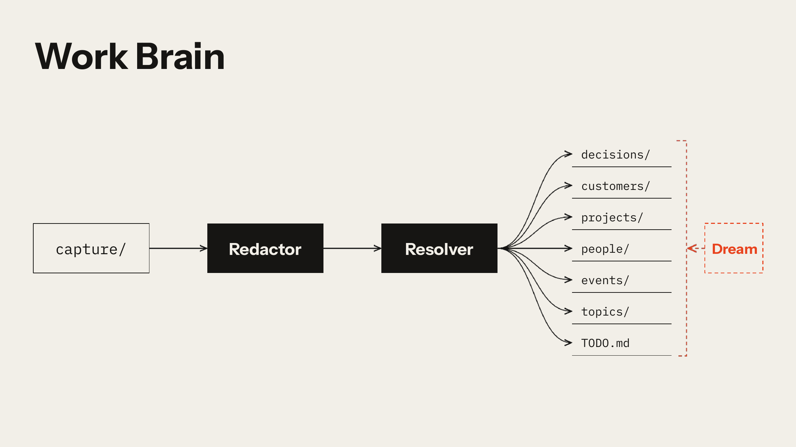
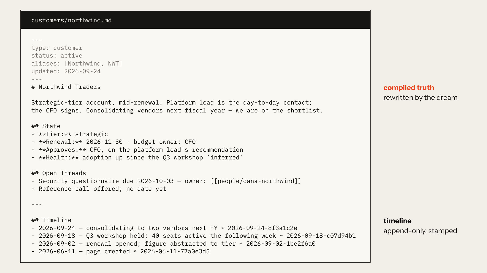

# Hippo: work brain

Hippo is a work brain: a folder of markdown files in git that an AI assistant keeps for you.
Each page has a current summary at the top and a dated log below it.

1. You file something, like a meeting note or a decision.
2. The assistant breaks it into pieces and files each one where it belongs. One meeting note
   might update a customer page, a project page, and two people pages, and add a task to the
   board.
3. Hippo dreams. The way a brain consolidates memory during sleep, it works through
   everything you've filed, rewrites the affected summaries to match, and flags anything that
   contradicts what a page already said.

A linter keeps every page in the same shape.

This is the **work** variant of Hippo. It holds customers, projects, people, decisions,
events, and topics and only ingests what you explicitly tell it to file.

This repo is the **skeleton**: the rules, the design reasoning, the linter, the skills, and
empty directories.

Credit: the conventions are adapted from Garry Tan's GBrain (two-layer pages, a resolver
you read before you write, brain-first lookup, date-hash capture ids, a dream). `DESIGN.md`
covers what Hippo kept, dropped, and added, and why. It also covers Hippo's own additions:
decisions as first-class pages, the redactor, the ontology as one file, and, in this
variant, explicit-only intake.

## What a page looks like

The account, the people, and the dates are invented. Everything else is exactly what the
resolver writes.

## How to install

Give your assistant the prompt in `INSTALL.md`, and it sets up your brain with you:

1. It copies this kit into a folder on your machine, with no history and no connection to
   GitHub.
2. It reads the rules.
3. It asks you about yourself and fills in your page.
4. It walks you through the page types (customers, projects, and so on) so you can change them.
5. It installs the three skills and runs the linter.

The dream runs when you ask for it, unless you choose to schedule it. If you'd rather set
things up yourself, the prompt doubles as a checklist.

The rules call you "the owner." They're the same rules the author's own brain runs on,
including how the assistant asks you questions (`AGENTS.md`, "Asking the owner"). Keep that
section or rewrite it to suit you.

## What's here

- `INSTALL.md`: the prompt that sets this up.
- `AGENTS.md`: behaviour and operating rules. Start here. (`CLAUDE.md` is a pointer to
  it, for assistants that load that filename automatically.)
- `RESOLVER.md`: routing and page anatomy; read before any write.
- `ONTOLOGY.md`: the entity types, in precedence order. The customisation seam.
- `REDACTOR.md`: what may never be stored, and what happens to it instead.
- `CONTEXT.md`: the glossary.
- `WATCHED.md`, `RESEARCH.md`, `TODO.md`: watched folders (empty by default), the research
  queue, the board.
- `ME.md`, `VOICE.md`: the owner's page and voice profile, empty.
- `tools/lint.py`: strict lint; the gate on dream commits and multi-page filings.
- `skills/`: the three skills (file, dream, ask). (Shipped under `brain-*` names; the
  install renames them if those names are already taken on your account.)
- `DESIGN.md`: what Hippo borrows from GBrain, leaves out, and adds, and the reasoning
  behind every choice you might want to change. Read it second.
- `capture/` is deliberately absent; it's gitignored and gets created by the first filing.

## License

MIT. See `LICENSE`. Use it however you like, keep the notice, and nothing here comes with
a warranty.
